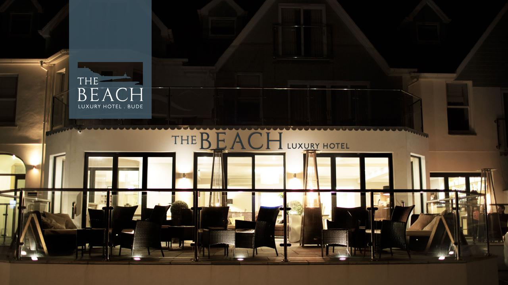
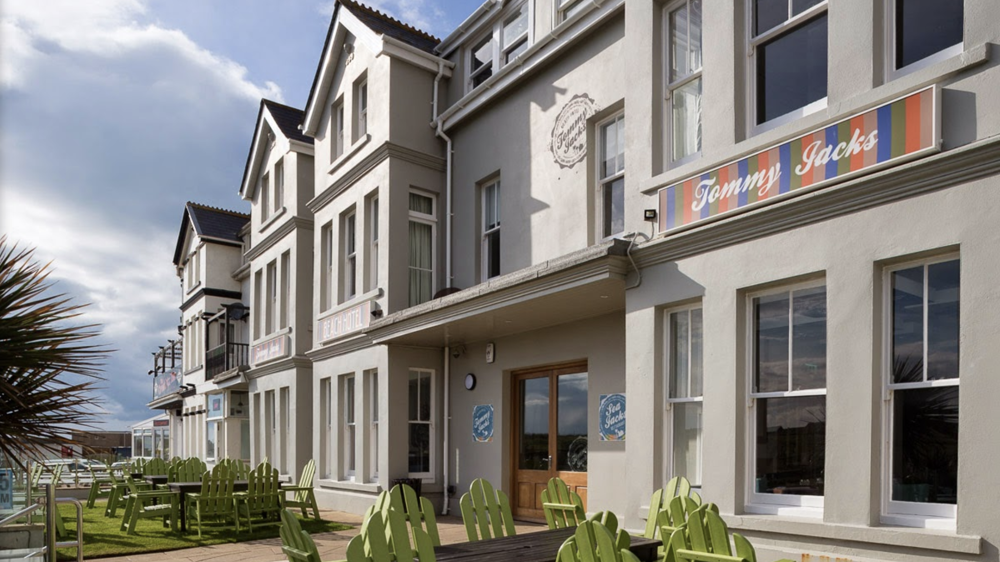

##part1

####Find the town of Bude in Western England. This is a town that is well-known as a beach resort. Ana here are two maps of Bude - a road map and a watercolor map:

####road map:
```{r,echo=FALSE,message=FALSE}
library(ggmap)
library(tidyverse)

# simple mapping with ggmap

# grab a center/zoom map and compute its bounding box
gc <- geocode("town of bude")
map <- get_map(gc)
bb <- attr(map, "bb")
bbox <- bb2bbox(bb)


ggmap(map) +
  geom_point(
    aes(x = lon, y = lat),
    data = gc, color = "red", size = 1
  )

map1 <- get_map(gc, zoom=16)

ggmap(map1) +
  geom_point(
    aes(x = lon, y = lat),
    data = gc, color = "blue", size = 3
  )

#set the zoom
map2 <- get_map("town of bude", zoom= 16,maptype = "roadmap")
ggmap(map2)
```

####watercolor map
```{r,echo=FALSE,message=FALSE}
map3 <- get_map("town of bude",zoom=16, maptype= "watercolor")
ggmap(map3)
```

#part 2

##Added Content After Fork
###Green: The Beach At Bude: -4.549112,50.831502
###Blue: Tommy Jacks Beach Hotel: -4.550904,50.836184

here is the vacation spots that I might like:
```{r,echo=FALSE,message=FALSE,warning=FALSE}
x <- "vocation stops" 
vs <- "vs address"
i <- c(1:9)
x[i] <- c("Breakwater Beach,UK", "Summerleaze Beach","Crooklets Beach","Northcott Mouth Beach,UK","Widemouth Beach","Sandy Mouth Beach,UK","Duckpool Beach,UK","Millook Haven Beach","cricket grounds,UK")


for(i in 1:9){
  vs <- geocode(x)
}
rownames(vs) <- x[1:9]

ggmap(get_googlemap(center = 'town of bude',zoom= 12,maptype = "roadmap"))+
geom_point(data=vs,aes(x=lon,y=lat),colour = 'red',size=1)+
geom_point(aes(x =  -4.549112 , y = 50.831502),color = "green", size = 1) +
geom_point(aes(x = -4.550904 , y = 50.836184),color = "blue", size = 1)

```

```{r,echo=FALSE,message=FALSE,warning=FALSE}
ggmap(get_googlemap(center = 'town of bude',zoom= 12,maptype = "hybrid"))+
geom_point(data=vs,aes(x=lon,y=lat),colour = 'red',size=1)+
geom_point(aes(x =  -4.549112 , y = 50.831502),color = "green", size = 1) +
geom_point(aes(x = -4.550904 , y = 50.836184),color = "blue", size = 1)
```

####And here is the route from the cricket grounds to the pub
```{r,echo=FALSE,message=FALSE}
pub <-  geocode("36 Lansdown Rd, Bude EX23 8BN, UK")

pub2 <- get_googlemap(center = "town of bude", source="google",zoom = 16)
ggmap(pub2,extent = "normal",zoom=25)+geom_point(data=pub,aes(x=lon,y=lat),color="blue")

from <- "Breakwater Beach,UK"
to <- "36 Lansdown Rd, Bude EX23 8BN, UK"
route_df <- route(from, to, mode = "walking",structure = "route")

```

#Images



